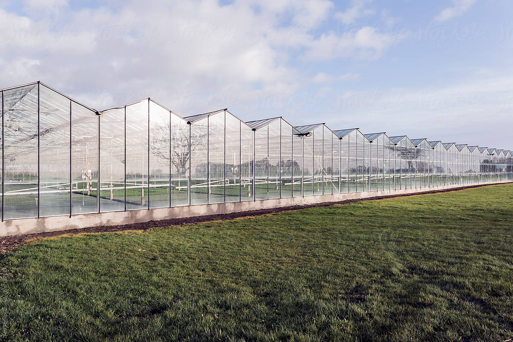
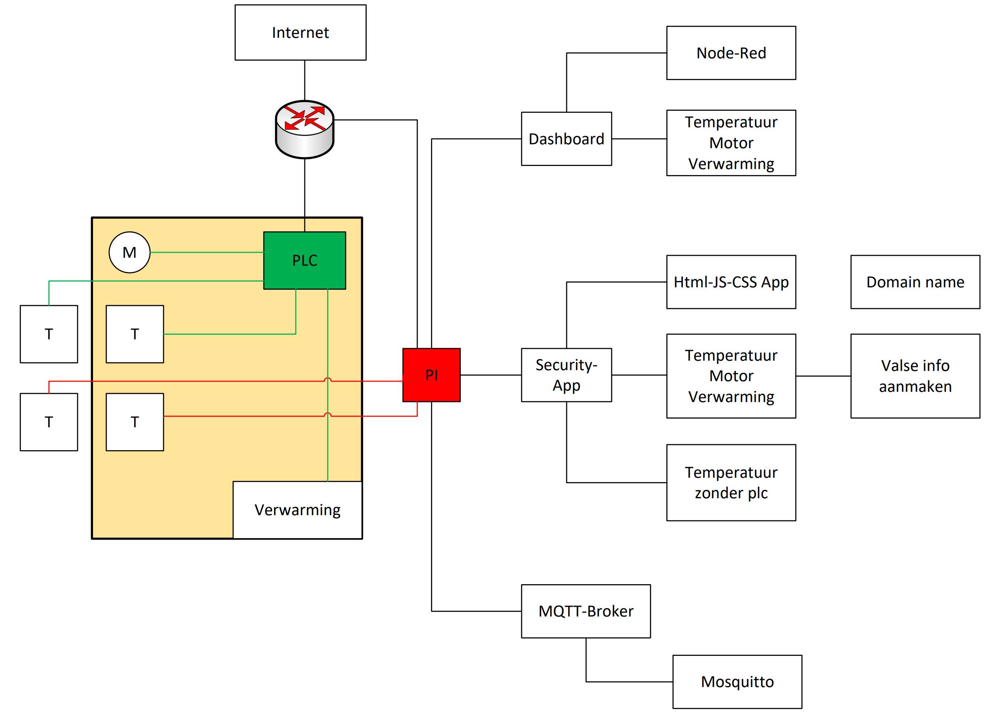
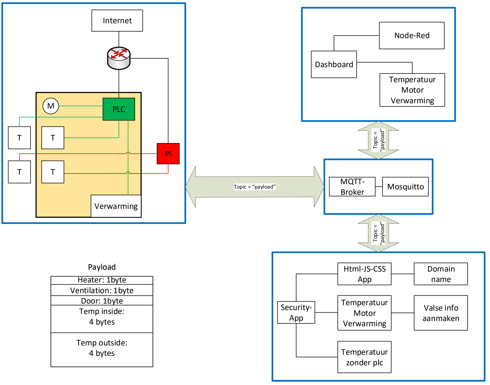
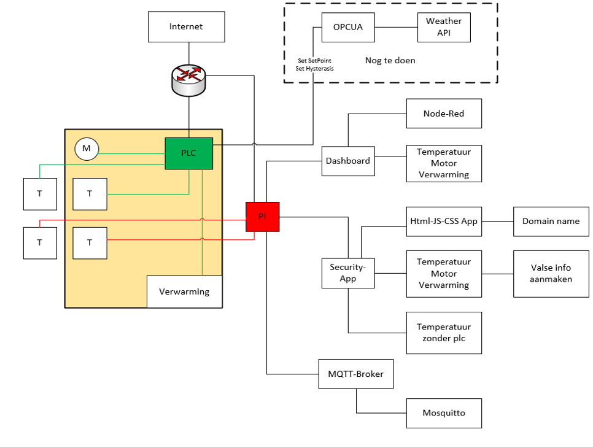
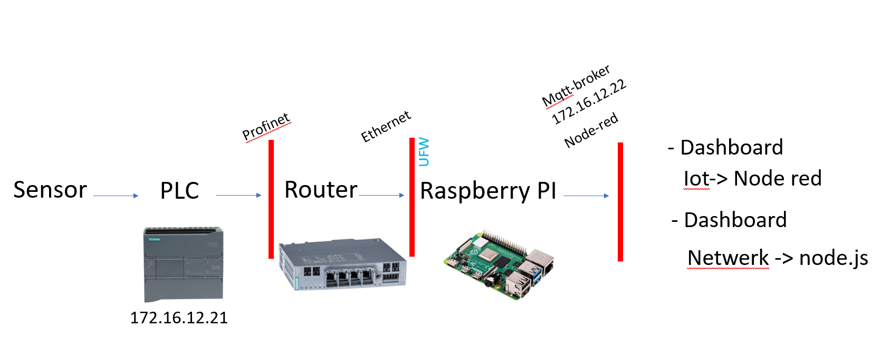

# Greenhouse

## Team Members

- Matias Vereecke
- Maxim Govaert
- Emiel Coucke

## Materials

- plc
- 4 temperature sensors(inside/outside)
- 1 or 2 Raspberry Pi 4b (Node Red and MQTT)
- 2 monitors

## The Project Abstract

The project we have chosen is, SIN Greenhouse. The main goal of the project is to impelment a SIN Greenhouse in a industrial network of, for example, a farmer. Display this on two dashboards: one to display the temperature, one to display but also to manipulate the data. To work out this project, the group members were divided into two groups. One group taking care of Raspberry Pi and With Node-Red and mqtt. Then also one with the security app. First we looked to set up the Raspberry Pi, the installation of node red and mqtt. Making a dashboard to display the temperature and display the status of the heater (on/off) and the motor for the window(open/closed). for the security app we will display the same, but we add the feature to manipulate the data of the temperatuur sensor so you menage to change the status of the elements like the heater in the serre.

## Schema

Here you have a full schema of the setup of or project.

|Schema|Mqtt_Schema|FreeOPC|
|---|---|---|
||||

### Schema PLC

## Projectinfo

fotos van de code met uitleg. 
fotos met de webpage/dashboards.

## Problem

<!-- - Manipulate states of devices on the PLC by sending data to the PLC.  -->

## Goal

## Analysis
- What are the constraints of the problem?
    - Everything must run on the RPI. 
- Which criteria are important, which are nice to have?
        - Data can be adjusted quickly
    - Data is displayed well.
- Which technological solutions exist for these constraints / criteria?
    - Keeping a good overview. Occasionally ask around if data is coming across well to the customer. 

## Result

## Possible extensions
- Securing the system so that the data can no longer be manipulated.
- Connect analog temperature sensors for comparison.
- By building an extra webpage where one can see how many packets of data are sent over mqtt. the number of connected clients etc.
## Conclusion

## Link to movie

https//

## Link to Reposetories

### [Documentation](https://github.com/vives-projectweek-2022/SIN-Greenhouse-Documentation)

### [Security app](https://github.com/vives-projectweek-2022/SIN-Greenhouse-security-dashboard)

### [Setup Raspberry Pi](https://github.com/vives-projectweek-2022/SIN-Greenhouse-Pi-Setup)

## Prerequisites

## components

see documentation: 
- [mqtt](./Components/mqtt.md)
- [security webpage](./Components/webpage.md)
- [Node Red](./Components/nodered.md)

## Bibliographie

### Mentors

- [Nico De Witte](https://github.com/BioBoost)
- [Piet Cordemans](https://github.com/pcordemans)
- [Sille Van Landschoot](https://github.com/sillevl)
- [Jonas Lannoo](https://github.com/JonasLannoo)
